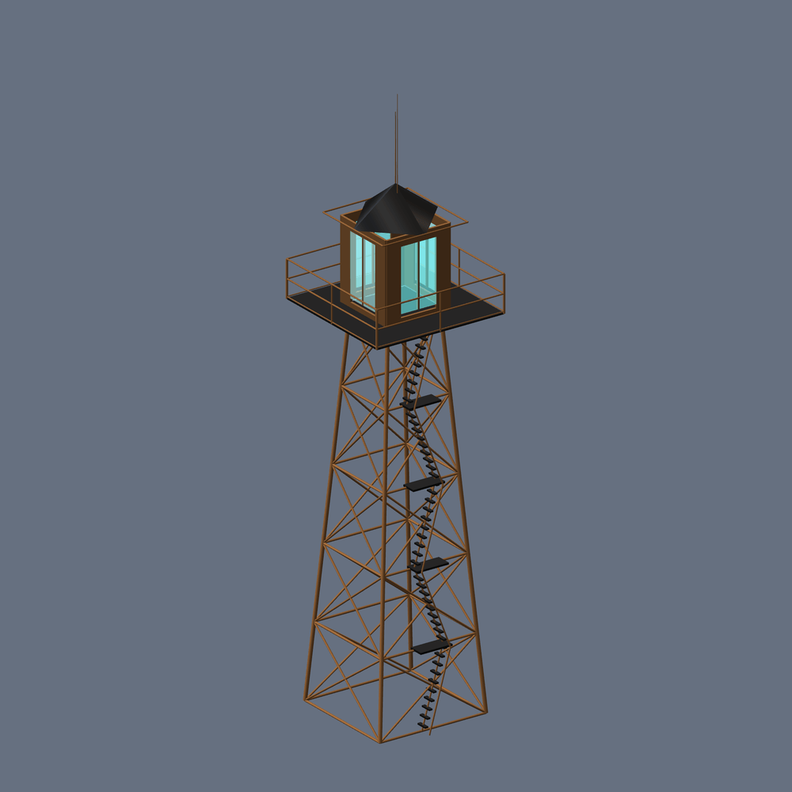

# Kiln

[](https://github.com/matthew-kissinger/kiln/actions/workflows/ci.yml)
[](LICENSE)

**Game-ready 3D models, built by an agent that writes them as code, renders them, and looks at what
came out.**

Kiln does not sample a mesh. A model writes a small JavaScript program that constructs the geometry;
Kiln runs it, exports a glTF binary, rasterizes six orthographic views, and hands the images back so
the model can fix what it sees. What you keep at the end is the GLB *and* the program that made it:
named parts, real metres, a diff you can read, and a file the next agent can edit instead of
regenerating from scratch.

Fifty assets below, each one a checked-in program in [`examples/`](examples/). Click any image
for the full-size render. No mesh was sampled, no geometry was hand-authored, and nothing was
touched in a DCC tool. A model wrote each program, looked at the render, and revised, which is why
every file's header comment reads like a post-mortem.

<table>
<tr>
  <td width="33%" valign="top"><a href="examples/renders/field-gun.png"></a><br><b><a href="examples/field-gun.kiln.js">field-gun</a></b><br>15,544 tris &middot; Claude Opus 5<br><sub>booleans and arrays</sub></td>
  <td width="33%" valign="top"><a href="examples/renders/cathedral.png"></a><br><b><a href="examples/cathedral.kiln.js">cathedral</a></b><br>19,842 tris &middot; Claude Opus 5<br><sub>repetition, and windows cut rather than placed</sub></td>
  <td width="33%" valign="top"><a href="examples/renders/mech.png"></a><br><b><a href="examples/mech.kiln.js">mech</a></b><br>18,398 tris &middot; Claude Opus 5<br><sub>armour oriented along a bone</sub></td>
</tr>
<tr>
  <td width="33%" valign="top"><a href="examples/renders/diving-helmet.png"></a><br><b><a href="examples/diving-helmet.kiln.js">diving-helmet</a></b><br>16,416 tris &middot; Claude Opus 5<br><sub>material contrast</sub></td>
  <td width="33%" valign="top"><a href="examples/renders/cafe-racer.png"></a><br><b><a href="examples/cafe-racer.kiln.js">cafe-racer</a></b><br>16,962 tris &middot; Claude Opus 5<br><sub>a tapered sweep along a curve</sub></td>
  <td width="33%" valign="top"><a href="examples/renders/penny-farthing.png"></a><br><b><a href="examples/penny-farthing.kiln.js">penny-farthing</a></b><br>12,450 tris &middot; Claude Opus 5<br><sub>curves and radial arrays</sub></td>
</tr>
<tr>
  <td width="33%" valign="top"><a href="examples/renders/sushi-store.png"></a><br><b><a href="examples/sushi-store.kiln.js">sushi-store</a></b><br>24,082 tris &middot; Claude Opus 5<br><sub>a facade as layered depth</sub></td>
  <td width="33%" valign="top"><a href="examples/renders/street-lamp.png"></a><br><b><a href="examples/street-lamp.kiln.js">street-lamp</a></b><br>13,036 tris &middot; Claude Opus 5<br><sub>revolved profiles, emissive + glass</sub></td>
  <td width="33%" valign="top"><a href="examples/renders/arcade-cabinet.png"></a><br><b><a href="examples/arcade-cabinet.kiln.js">arcade-cabinet</a></b><br>19,916 tris &middot; Gemini 3.8 Flash<br><sub>silhouette from a swept profile</sub></td>
</tr>
<tr>
  <td width="33%" valign="top"><a href="examples/renders/robot-arm.png"></a><br><b><a href="examples/robot-arm.kiln.js">robot-arm</a></b><br>15,324 tris &middot; Claude Opus 5<br><sub>a kinematic chain that animates</sub></td>
  <td width="33%" valign="top"><a href="examples/renders/carousel.png"></a><br><b><a href="examples/carousel.kiln.js">carousel</a></b><br>16,356 tris &middot; Gemini 3.8 Flash<br><sub>a radial array that turns</sub></td>
  <td width="33%" valign="top"><a href="examples/renders/ferris-wheel.png"></a><br><b><a href="examples/ferris-wheel.kiln.js">ferris-wheel</a></b><br>10,452 tris &middot; Gemini 3.8 Flash<br><sub>a lattice that still reads at distance</sub></td>
</tr>
<tr>
  <td width="33%" valign="top"><a href="examples/renders/orrery.png"></a><br><b><a href="examples/orrery.kiln.js">orrery</a></b><br>15,720 tris &middot; Gemini 3.8 Flash<br><sub>arrayed gear teeth on one drive</sub></td>
  <td width="33%" valign="top"><a href="examples/renders/longcase-clock.png"></a><br><b><a href="examples/longcase-clock.kiln.js">longcase-clock</a></b><br>12,600 tris &middot; Gemini 3.8 Flash<br><sub>case joinery at furniture scale</sub></td>
  <td width="33%" valign="top"><a href="examples/renders/radio-telescope.png"></a><br><b><a href="examples/radio-telescope.kiln.js">radio-telescope</a></b><br>16,532 tris &middot; Gemini 3.8 Flash<br><sub>a dish that tracks</sub></td>
</tr>
<tr>
  <td width="33%" valign="top"><a href="examples/renders/anglerfish.png"></a><br><b><a href="examples/anglerfish.kiln.js">anglerfish</a></b><br>19,108 tris &middot; Claude Opus 5<br><sub>organic form, and an emissive lure</sub></td>
  <td width="33%" valign="top"><a href="examples/renders/hot-air-balloon.png"></a><br><b><a href="examples/hot-air-balloon.kiln.js">hot-air-balloon</a></b><br>9,816 tris &middot; Gemini 3.8 Flash<br><sub>a lathed envelope in twenty-four gores</sub></td>
  <td width="33%" valign="top"><a href="examples/renders/vending-machine.png"></a><br><b><a href="examples/vending-machine.kiln.js">vending-machine</a></b><br>12,468 tris &middot; Claude Opus 5<br><sub>emissive area as the enemy of shape</sub></td>
</tr>
<tr>
  <td width="33%" valign="top"><a href="examples/renders/gramophone.png"></a><br><b><a href="examples/gramophone.kiln.js">gramophone</a></b><br>10,724 tris &middot; Gemini 3.8 Flash<br><sub>brass against mahogany, and a horn that folds out of a lid</sub></td>
  <td width="33%" valign="top"><a href="examples/renders/typewriter.png"></a><br><b><a href="examples/typewriter.kiln.js">typewriter</a></b><br>14,128 tris &middot; Muse Spark 1.3<br><sub>a mechanism arrayed on an arc</sub></td>
  <td width="33%" valign="top"><a href="examples/renders/lighthouse.png"></a><br><b><a href="examples/lighthouse.kiln.js">lighthouse</a></b><br>16,492 tris &middot; Muse Spark 1.3<br><sub>a whole small site, not just the tower</sub></td>
</tr>
<tr>
  <td width="33%" valign="top"><a href="examples/renders/steam-locomotive.png"></a><br><b><a href="examples/steam-locomotive.kiln.js">steam-locomotive</a></b><br>19,256 tris &middot; Muse Spark 1.3<br><sub>coupled wheels, and rods that have to reach them</sub></td>
  <td width="33%" valign="top"><a href="examples/renders/windmill.png"></a><br><b><a href="examples/windmill.kiln.js">windmill</a></b><br>9,872 tris &middot; DeepSeek V4 Flash<br><sub>coursing that is a texture, not a stack of rings</sub></td>
  <td width="33%" valign="top"><a href="examples/renders/aircraft-carrier.png"></a><br><b><a href="examples/aircraft-carrier.kiln.js">aircraft-carrier</a></b><br>17,904 tris &middot; Claude Opus 5<br><sub>a third of a kilometre, laid out by arithmetic</sub></td>
</tr>
<tr>
  <td width="33%" valign="top"><a href="examples/renders/air-defense-radar.png"></a><br><b><a href="examples/air-defense-radar.kiln.js">air-defense-radar</a></b><br>16,094 tris &middot; Claude Opus 5<br><sub>an array face that is a grid, not a texture</sub></td>
  <td width="33%" valign="top"><a href="examples/renders/fighter-jet.png"></a><br><b><a href="examples/fighter-jet.kiln.js">fighter-jet</a></b><br>18,172 tris &middot; Claude Opus 5<br><sub>an aerofoil lofted station by station</sub></td>
  <td width="33%" valign="top"><a href="examples/renders/comms-satellite.png"></a><br><b><a href="examples/comms-satellite.kiln.js">comms-satellite</a></b><br>18,824 tris &middot; Claude Opus 5<br><sub>a 21 m span that still has a 2.6 m bus in it</sub></td>
</tr>
<tr>
  <td width="33%" valign="top"><a href="examples/renders/victorian-greenhouse.png"></a><br><b><a href="examples/victorian-greenhouse.kiln.js">victorian-greenhouse</a></b><br>10,462 tris &middot; Gemini 3.8 Flash<br><sub>glazing bars as structure, not as a texture</sub></td>
  <td width="33%" valign="top"><a href="examples/renders/gothic-gatehouse.png"></a><br><b><a href="examples/gothic-gatehouse.kiln.js">gothic-gatehouse</a></b><br>10,428 tris &middot; Gemini 3.8 Flash<br><sub>two drums, one arch, and a bridge that lands</sub></td>
  <td width="33%" valign="top"><a href="examples/renders/cable-stayed-bridge.png"></a><br><b><a href="examples/cable-stayed-bridge.kiln.js">cable-stayed-bridge</a></b><br>7,580 tris &middot; Omen Alpha<br><sub>a stay pattern that has to reach the deck</sub></td>
</tr>
<tr>
  <td width="33%" valign="top"><a href="examples/renders/fire-lookout-tower.png"></a><br><b><a href="examples/fire-lookout-tower.kiln.js">fire-lookout-tower</a></b><br>4,408 tris &middot; LongCat 2.0<br><sub>a whole tower at four thousand triangles</sub></td>
  <td width="33%" valign="top"><a href="examples/renders/tram.png"></a><br><b><a href="examples/tram.kiln.js">tram</a></b><br>12,540 tris &middot; Gemini 3.8 Flash<br><sub>a body that is mostly window</sub></td>
  <td width="33%" valign="top"><a href="examples/renders/tugboat.png"></a><br><b><a href="examples/tugboat.kiln.js">tugboat</a></b><br>9,856 tris &middot; Gemini 3.8 Flash<br><sub>a hull lofted station by station</sub></td>
</tr>
<tr>
  <td width="33%" valign="top"><a href="examples/renders/deep-sea-diver.png"></a><br><b><a href="examples/deep-sea-diver.kiln.js">deep-sea-diver</a></b><br>10,876 tris &middot; Gemini 3.8 Flash<br><sub>a figure built out of hardware, not anatomy</sub></td>
  <td width="33%" valign="top"><a href="examples/renders/pumpjack.png"></a><br><b><a href="examples/pumpjack.kiln.js">pumpjack</a></b><br>10,236 tris &middot; Gemini 3.8 Flash<br><sub>a linkage that would actually swing</sub></td>
  <td width="33%" valign="top"><a href="examples/renders/drilling-rig.png"></a><br><b><a href="examples/drilling-rig.kiln.js">drilling-rig</a></b><br>11,048 tris &middot; Gemini 3.8 Flash<br><sub>a site rather than a silhouette</sub></td>
</tr>
<tr>
  <td width="33%" valign="top"><a href="examples/renders/harbour-crane.png"></a><br><b><a href="examples/harbour-crane.kiln.js">harbour-crane</a></b><br>10,568 tris &middot; Gemini 3.8 Flash<br><sub>steelwork that still reads as steelwork</sub></td>
  <td width="33%" valign="top"><a href="examples/renders/crawler-crane.png"></a><br><b><a href="examples/crawler-crane.kiln.js">crawler-crane</a></b><br>12,660 tris &middot; MiniMax M3<br><sub>a boom that is one bay, repeated</sub></td>
  <td width="33%" valign="top"><a href="examples/renders/excavator.png"></a><br><b><a href="examples/excavator.kiln.js">excavator</a></b><br>12,400 tris &middot; Omen Alpha<br><sub>rams that line up with the joints they drive</sub></td>
</tr>
<tr>
  <td width="33%" valign="top"><a href="examples/renders/printing-press.png"></a><br><b><a href="examples/printing-press.kiln.js">printing-press</a></b><br>10,188 tris &middot; Gemini 3.8 Flash<br><sub>a mechanism you could explain from the render</sub></td>
  <td width="33%" valign="top"><a href="examples/renders/pipe-organ.png"></a><br><b><a href="examples/pipe-organ.kiln.js">pipe-organ</a></b><br>10,340 tris &middot; Gemini 3.8 Flash<br><sub>ranks arrayed without becoming a comb</sub></td>
  <td width="33%" valign="top"><a href="examples/renders/planetarium-projector.png"></a><br><b><a href="examples/planetarium-projector.kiln.js">planetarium-projector</a></b><br>10,932 tris &middot; Gemini 3.8 Flash<br><sub>black on black, and still legible</sub></td>
</tr>
<tr>
  <td width="33%" valign="top"><a href="examples/renders/astronomical-clock.png"></a><br><b><a href="examples/astronomical-clock.kiln.js">astronomical-clock</a></b><br>9,324 tris &middot; Gemini 3.8 Flash<br><sub>a dial carrying the whole asset</sub></td>
  <td width="33%" valign="top"><a href="examples/renders/espresso-machine.png"></a><br><b><a href="examples/espresso-machine.kiln.js">espresso-machine</a></b><br>19,080 tris &middot; GLM 5.3 Flash<br><sub>chrome, which is the hardest thing to shade</sub></td>
  <td width="33%" valign="top"><a href="examples/renders/pinball-machine.png"></a><br><b><a href="examples/pinball-machine.kiln.js">pinball-machine</a></b><br>8,700 tris &middot; GLM 5.3 Flash<br><sub>a head that has to stand on something</sub></td>
</tr>
<tr>
  <td width="33%" valign="top"><a href="examples/renders/trebuchet.png"></a><br><b><a href="examples/trebuchet.kiln.js">trebuchet</a></b><br>2,652 tris &middot; Gemini 3.8 Flash<br><sub>a siege engine in 2,652 triangles</sub></td>
  <td width="33%" valign="top"><a href="examples/renders/rigid-airship.png"></a><br><b><a href="examples/rigid-airship.kiln.js">rigid-airship</a></b><br>11,764 tris &middot; GPT-6 Astra<br><sub>one lofted envelope, with everything hung off it</sub></td>
  <td width="33%" valign="top"><a href="examples/renders/orbital-station.png"></a><br><b><a href="examples/orbital-station.kiln.js">orbital-station</a></b><br>10,212 tris &middot; GPT-6 Astra<br><sub>a ring that has to close on itself</sub></td>
</tr>
<tr>
  <td width="33%" valign="top"><a href="examples/renders/blast-furnace.png"></a><br><b><a href="examples/blast-furnace.kiln.js">blast-furnace</a></b><br>11,964 tris &middot; GPT-6 Astra<br><sub>a plant rather than an object</sub></td>
  <td width="33%" valign="top"><a href="examples/renders/clock-tower.png"></a><br><b><a href="examples/clock-tower.kiln.js">clock-tower</a></b><br>11,664 tris &middot; GPT-6 Astra<br><sub>four faces that have to agree</sub></td>
</tr>
</table>

Every shot is regenerated by `bun scripts/hero-shots.ts` straight from those programs, through the
same PBR render port the agent loop uses. Nothing in this README was retouched.

A still is a weak claim about a mesh, so all fifty are also up at
**[the specimen gallery](https://matthew-kissinger.github.io/kiln/)**, where you can orbit them,
flip them to wireframe to see the topology under the shading, and pull the GLB down to open in
whatever you use. That page holds no assets either: its build runs the same programs through the
same evaluator, so what you orbit there is what the file beside it produces today rather than an
export somebody remembered to refresh. It lives in [`site/`](site).

A gallery is thin evidence when it is all one model's work, so it is worth saying who wrote what.
35 of the 50 programs above were not written by Claude. Gemini 3.8 Flash wrote 21 of them through
the Antigravity CLI and GPT-6 Astra wrote 4 through Codex; Muse Spark 1.3 wrote 3, GLM 5.3 Flash
and Omen Alpha 2 each, and there is 1 apiece from DeepSeek V4 Flash, MiniMax M3 and LongCat 2.0.
The rest came through OpenCode, bar the fire lookout tower, which came out of Hermes -- a Python
agent with its own config, its own skill store and its own provider routing, and the one harness
here that is nothing like Claude Code.

Every one of those runs was dispatched into a directory holding nothing but the brief and the Kiln
skills: no engine source, and no finished example to copy an interface from. Nothing in the tools
or the skills changed for any of them, which is the claim the gallery is really making. The loop
belongs to neither the model nor the harness it was built in, and it does not need the model to
have read this repository first.

## And they move

`animate()` is part of the same program. It returns named clips built from rotation and position
tracks against the parts the program already created, so a joint that moves is the joint that was
modelled -- there is no separate rig to keep in sync, and a diff of the motion is a diff of the same
file. The model reviews a clip the way it reviews a still: `kiln_screenshot_animation` poses the
scene across the clip and hands back the frames, which is how a walk that slides, a knee that bends
backwards, or an arm that swings through its own base gets caught before the GLB is written.

<table>
<tr>
  <td width="50%" valign="top"><br><b><a href="examples/robot-arm.kiln.js">robot-arm</a></b><br><sub>a six-axis pick-and-place cycle</sub></td>
  <td width="50%" valign="top"><br><b><a href="examples/carousel.kiln.js">carousel</a></b><br><sub>a turn, with the horses on their own phase</sub></td>
</tr>
<tr>
  <td width="50%" valign="top"><br><b><a href="examples/orrery.kiln.js">orrery</a></b><br><sub>planets on nested arms off one drive</sub></td>
  <td width="50%" valign="top"><br><b><a href="examples/radio-telescope.kiln.js">radio-telescope</a></b><br><sub>a slew in azimuth and elevation</sub></td>
</tr>
</table>

These are rendered by `bun scripts/anim-gifs.ts` from the checked-in programs, through the same PBR
port as the stills. One detail in that script is worth borrowing if you build something similar: the
port fits its camera to whatever bounding box it is handed, so a sequence whose posed extent changes
-- the arm above varies by 63% between folded and reaching -- will appear to breathe as the camera
refits every frame. Because the projection is orthographic and the fit is exact, each frame can be
put back onto one shared camera by a scale and a translation that are both computable, which is a
correction rather than an approximation.


*The contact sheet the model looks at. `examples/field-gun.kiln.js`, 15,544 triangles: a revolved
bronze barrel bored with a boolean, a stepped oak carriage carrying strapwork and bolt heads, and
twelve-spoke wheels with iron tyres.*

```bash
bun run kiln render examples/field-gun.kiln.js --views sheet.png
```

## What this does that asking your agent directly does not

Any coding agent will cheerfully write you a Three.js scene of a motorcycle. It writes it in one
pass, never sees the result, and reports success. The failure mode is not bad code, it is confident
code about geometry nobody looked at: a front mudguard sunk inside the tyre it is meant to arch over,
an exhaust routed into the engine instead of out the back, a robot arm whose pick pose reaches
upward. All three of those are in this repository's example headers, because they happened and the
loop caught them.

Kiln closes that loop, and then declines to trust it on its own.

The model gets eyes. `kiln_render` builds the program, exports the GLB, and returns the metrics and
the six-view contact sheet in one tool result, so looking costs a single call rather than a detour
through a file the agent cannot open. Every render also reports `viewFidelity`, which tells the agent
in band whether it may judge material from what it is looking at or only geometry. An agent that
cannot see a texture must not conclude the texture is wrong.

What vision is bad at gets checked by machine instead. Self-intersection, part connectivity, floating
geometry, degenerate and non-unit normals, triangle budget, and glTF validity all fail closed with no
model call, and the QA context is deliberately image-free so a rule *structurally cannot* read a
render buffer. No render will ever show you a normal of length 0.9994. The validator rejects it on
sight, and that matters because the exporters downstream will too.

The model reads the catalog before it writes anything. `kiln_list_primitives` returns the real
signatures, so the program is written against the API that exists rather than the one the model
half-remembers from some other engine. That one step is the difference between a run that compiles
and a run that burns four turns failing on names.

And what comes out is contracted, not merely valid. Metres, +Y up, sitting on the ground plane at
y=0, materials drawn from a palette chosen for instancing, a triangle count that lands where the
gallery lands, and a versioned `integrationManifest` sidecar carrying the artifact hash, bounds,
grounding offset, semantic role, and structural QA. Drop the file into a scene and it is the right
size, the right way up, and standing on the floor.

## Where it works and where it does not

Kiln is good at things that were manufactured. A form that comes from a profile turned on a lathe, a
plate bent to a radius, a frame welded out of tube, or one bay repeated the length of a nave is a
form you can describe as a program, and a program is what Kiln writes. That covers more of an art
list than it sounds like: vehicles, aircraft and ships; ordnance and defence hardware; machinery,
instruments and tooling; furniture, fittings and shop dressing; architecture and the modular kit
pieces buildings are assembled out of; and the long tail of props that fill a level and never get a
close-up. The gallery is deliberately all of that.

It is at its best when you want many of them. A program with numbers in it is already a family, so
the second crate is a parameter rather than another generation, and a street's worth of lamps is one
casting with different arm lengths. That is also where the loop pays for itself: authoring is minutes
of unattended wall clock, and the marginal variant is a rerun. Dispatching a batch of them without
supervision is a documented path further down this page, not an aspiration.

It is bad at things that grew. Faces, hands, cloth, foliage, anything with muscle under the skin all
want a sculpt, and the honest recommendation there is a diffusion model. Trellis, Hunyuan3D and their
successors will beat this outright, and it is not close.

It is also not reconstruction. Given one reference image, Kiln infers the sides it cannot see rather
than measuring them. If you need *that* object rather than something like it, reach for
photogrammetry or a scanner.

The economics differ too, and it is worth being plain about it. A mesh sampler answers in seconds.
Kiln spends minutes, because looking is the expensive part and looking is the entire point. What
those minutes buy is that the cost does not come back. Edit the wheel radius, rerun, and you get the
same motorcycle with bigger wheels; regenerate a sampled mesh and you get a different motorcycle.
The second version of a Kiln asset is a diff, and the hundredth variant of it is a loop.

Code-as-geometry with a model in the loop is not a category Kiln invented, and there are other
projects in it. What is unusual here is the shape of the loop rather than the idea of it: the vision
pass has no browser anywhere in it, so it runs in a container and in CI; and the model's judgment
sits on top of a deterministic gate layer that never sees pixels, so a confident wrong answer cannot
promote a broken asset.

## Where the tokens go

Most of what an agent spends on 3D is not spent on the object. It guesses at an API and reads the
errors back, renders into a file it has no way to open, narrates the geometry to itself in prose
because narration is all it has, and re-derives on every asset the same things it worked out on the
last one. Those turns are expensive and most of them carry an image, and none of them is the model
thinking about the shape.

Kiln pays that discovery once, up front, and keeps it out of the loop. The primitive catalog is a
single call that returns real signatures, so the program is written against the API that exists
rather than the one the model half-remembers from some other engine. Looking is a single call too:
`kiln_render` builds the program, exports the GLB, rasterizes six views, and returns the contact
sheet and the metrics in one tool result, so a revision costs one look instead of a render, a file
write, a read that fails, and a paragraph of speculation. The deterministic gates cost no model
tokens at all, because self-intersection, floating parts, non-unit normals, triangle budget and glTF
validity are all decided in process and their context is image-free by construction. And a fix is a
patch rather than a rewrite: `kiln_edit` replaces exact strings and re-renders, so the tenth revision
does not re-emit the first nine.

What sits in context permanently is small, and it is measured rather than asserted. The seven tool
schemas derive to 15,839 characters of JSON Schema, call it four thousand tokens. The five skills
advertise themselves in 1,692 characters of front matter, four hundred more; their bodies come to
about eight thousand tokens between them and load only when one of them actually fires. Everything
else a model would otherwise have to be told about building an asset lives in the engine, where it
is executed rather than read.

The wall clock is honest about the trade. An unattended dispatch of a mid-sized asset lands between
two and six minutes on one machine, and thirteen for the carrier at the end of the gallery, which is
a third of a kilometre long and has the part count to match. Several of the assets above were
authored exactly that way, in a batch nobody watched.

## Quickstart

No API key required. Render one of the checked-in programs and look at the result:

```bash
git clone https://github.com/matthew-kissinger/kiln && cd kiln
bun install
bun run kiln render examples/crate.kiln.js --out crate.glb --views sheet.png
```

That exercises the geometry build, the QA gates, and the rasterizer with no model and no key. The
default `--render auto` glances for a local GPU render service and falls back to the CPU rasterizer
when there is none, so it works unchanged on a machine with no GPU.

To generate from a prompt, set one provider key and:

```bash
bun run kiln generate "a weathered wooden crate" --out crate.glb
```

## Install it in your agent

Kiln ships as an [Agent Plugin](https://agentplugins.codes/): an MCP server exposing the tool
surface, alongside five skills that teach an agent to use it well, covering authoring an asset,
refining one that already exists, composing finished assets into a scene, proving one works inside a
real project, and wiring another harness up to generate a library at scale. Pick your harness below; [`docs/install.md`](docs/install.md) has the long
form, including the sharp edges.

Every route starts with a clone and its dependencies, because the engine ships TypeScript source
rather than a published package:

```bash
git clone https://github.com/matthew-kissinger/kiln && cd kiln && bun install
bun run kiln render examples/crate.kiln.js --out crate.glb --views sheet.png
```

If that writes a GLB and a contact sheet, the engine is fine and anything that goes wrong afterwards
is transport configuration.

**The server your harness launches runs on Node, not Bun.** `dist/mcp-server.mjs` is a committed
bundle, because a plugin install is a git clone with no build step, and it is what every config
below points at. Bun is the development toolchain here; it is not something a user of the plugin
needs on their `PATH`. That distinction is not cosmetic -- it is the fix for a real bug, and
[`src/__tests__/mcp-bundle.test.ts`](src/__tests__/mcp-bundle.test.ts) rebuilds the bundle, compares
it byte for byte, and then speaks MCP to it under `node` so it cannot rot.

<details>
<summary><b>Claude Code</b></summary>

```bash
claude plugin marketplace add matthew-kissinger/kiln
claude plugin install kiln@kiln
```

Verify with `claude mcp list`, where you want `plugin:kiln:kiln … ✔ Connected`.
</details>

<details>
<summary><b>Antigravity CLI (<code>agy</code>)</b></summary>

Two commands, because they do different jobs:

```bash
agy plugin install .
agy mcp add --env KILN_RENDER=auto kiln node /absolute/path/to/kiln/dist/mcp-server.mjs
```

The first brings in the skills. The second is not redundant: as of `agy` 1.1.25, installing a
plugin does **not** register the MCP servers it declares. `agy plugin validate .` will happily
report `mcpServers: 1 processed` while `agy mcp list` reports `No MCP servers configured`, and the
agent sees no tools. `agy mcp add` is the supported registration and writes the entry itself, so
there is no JSON to hand-edit. Confirm with `agy mcp list`.

For headless (`agy -p`) runs you also need permission grants in
`~/.gemini/antigravity-cli/settings.json`. Scoped `mcp()` and `write_file()` rules work; `command()`
targets are soft-denied in print mode whatever the syntax, so only `command(*)` passes. See
[`docs/install.md`](docs/install.md#headless-permissions) for the evidence and the upstream issue.
</details>

<details>
<summary><b>OpenCode</b></summary>

OpenCode has no plugin manifest to install -- its plugins are JavaScript modules, which is a
different thing entirely -- so Kiln arrives as an MCP server plus skills, and both are one-time
edits. Put this in `~/.config/opencode/opencode.json`, or in an `opencode.json` at your project
root:

```json
{
  "$schema": "https://opencode.ai/config.json",
  "mcp": {
    "kiln": {
      "type": "local",
      "command": ["node", "/absolute/path/to/kiln/dist/mcp-server.mjs"],
      "enabled": true,
      "environment": { "KILN_RENDER": "auto" },
      "timeout": 30000
    }
  }
}
```

Three details differ from every other client on this page and each one fails silently if you carry
a config over unchanged: the key is `mcp` rather than `mcpServers`, the type is `local` rather than
`stdio`, and the command and its arguments are a single array rather than a `command` plus `args`.
The schema rejects unknown keys, so a stray `env` is not ignored, it is an error.

`timeout` bounds the connection handshake, not the tool calls that follow, which is the opposite of
what the name suggests. Set to 200 ms the server never connects and `opencode mcp list` reports
`kiln failed`; set to 1500 ms it connects, and a `kiln_render` that takes nine seconds still comes
back with its picture. The handshake itself measures around 1.2 seconds against a default of five,
so the default works and an explicit value only buys headroom for a cold start.

Verify with `opencode mcp list`, where you want `kiln connected`.

The skills are the second half, and OpenCode reads Anthropic's `SKILL.md` layout directly. Copy them
to `~/.config/opencode/skills/` for every project, or to `.claude/skills/` inside one -- OpenCode
looks in both, along with `.agents/skills/`:

```bash
cp -r skills/* ~/.config/opencode/skills/
```

One cosmetic surprise: OpenCode namespaces tools by server, so `kiln_render` is presented to the
model as `kiln_kiln_render`. Nothing needs changing, and models find the tools anyway, but it is
what you will see in the transcript.
</details>

<details>
<summary><b>Hermes</b></summary>

Hermes is a Python agent with its own YAML config, its own skill store and its own provider routing,
which makes it the honest test of whether any of this is portable rather than Claude-Code-shaped.
Two commands attach both halves:

```bash
hermes mcp add kiln --command node --args /absolute/path/to/kiln/dist/mcp-server.mjs --env KILN_RENDER=auto
hermes config set skills.external_dirs /absolute/path/to/kiln/skills
```

The first connects immediately, prints the seven tools it found and asks whether to enable them. The
second is how Hermes finds skills at all: it reads a list of absolute directories out of its config
rather than `.claude/skills` out of the working directory, so pointing it at this repository is the
whole step. `hermes mcp list` and `hermes skills list` confirm both halves landed.

Hermes ships with no model provider, so a fresh install fails on `No inference provider configured`
before the brief is ever read -- which reads exactly like a broken plugin and is not one.
[`docs/install.md`](docs/install.md) has the login and the follow-up that catches everybody out.
</details>

<details>
<summary><b>Codex CLI</b></summary>

Codex keeps its MCP servers in TOML at `~/.codex/config.toml`, and the path has to be absolute:

```toml
[mcp_servers.kiln]
command = "node"
args = ["/absolute/path/to/kiln/dist/mcp-server.mjs"]
env = { KILN_RENDER = "auto" }
```

That is the whole of it for interactive `codex`, which asks before each tool call. `codex exec` is
the one that needs a flag: it pins the approval policy to `never`, and a `never` policy refuses an
MCP call rather than queueing it, so a scripted run comes back in under a minute reporting that
`kiln_list_primitives` was blocked and having written nothing. Add `--approve-for-me`, which routes
approvals through automatic review and picks the workspace-write sandbox itself -- which is also why
it is rejected alongside `--sandbox`.
</details>

<details>
<summary><b>Cursor, Zed, or any MCP client</b></summary>

Point the client at the bundle with an **absolute** path. The server resolves its own paths from
`import.meta.url` and never reads `process.cwd()`, so the launch directory does not matter:

```json
{
  "mcpServers": {
    "kiln": {
      "type": "stdio",
      "command": "node",
      "args": ["/absolute/path/to/kiln/dist/mcp-server.mjs"],
      "env": { "KILN_RENDER": "auto" }
    }
  }
}
```
</details>

<details>
<summary><b>In-process TypeScript, no MCP</b></summary>

```ts
import { createKilnToolRegistry } from 'kiln/tools';
```

`kiln/tools` imports no agent SDK, so porting to a harness that is not Strands does not drag Strands
along. [`examples/strands-harness.ts`](examples/strands-harness.ts) is the whole integration in about
sixty lines.
</details>

Whichever route you took, check it before you judge anything by the assets it produces:

```bash
bun run smoke:harness
```

That sends a short brief into a throwaway directory for every CLI it finds -- call one tool, write a
four-line program, validate it -- and then builds what came back with the engine rather than
believing the agent's own account of how it went. It matters because every wiring failure here is
silent. A harness that cannot see the server does not say so, one that can see it but will not grant
it behaves the same way, and so does a model that simply was not up to the job. Three different
problems, one symptom, and no way to tell them apart by looking at a bad asset.

The MCP server exposes the **raw tools**, which means *your* agent is the author. It writes the
program, looks at the render, and iterates using its own model, with no separate provider key and no
nested agent loop. The trade is that your harness then supplies both the author and the vision judge:
the deterministic gates still run independently, but the eyes/judge separation the production system
maintained is collapsed. That is deliberate, and it is what buys the portability.

## Seeing the work: CPU and GPU

There are two renderers in this repository, and the mode picks between them. Neither wants a cloud
account.

```bash
--render auto          # default: local GPU service if one is up, else CPU
--render cpu           # force the deterministic CPU rasterizer
--render gpu           # force GPU; error rather than degrade
--render-port <url>    # a GPU render service anywhere, local or remote
```

### What the difference actually looks like

The same program, the field gun above, rendered both ways:

| CPU rasterizer | GPU PBR |
|---|---|
|  |  |

Geometry is equally legible in both. On the CPU sheet you can still count the twelve spokes, see the
bolt heads on the cheek straps, and read the stepped carriage; silhouette, proportion, orientation and
part contact all survive intact.

What does not survive is every material cue in the asset. The oak carriage, the iron tyres, and the
bronze barrel render as **the same white plastic**. Not dimmer, *absent*. The procedural albedo and
the derived normal maps that separate weathered wood from gun-metal simply do not exist in a
flat-shaded render, so an agent looking at the left-hand sheet has no way to tell this asset has three
materials at all.

**If your assets have textures or metal, use the GPU.** That is most real assets, and it is why `auto`
reaches for a GPU first. The CPU rasterizer is the floor that guarantees the loop runs anywhere, in
CI, in a container, on a laptop with no GPU. It is not the target.

|  | CPU raster | GPU PBR |
|---|---|---|
| Why it exists | Runs where there is no GPU at all | Material, texture, and metal legibility |
| Cost | None | A render service, local or remote |
| Determinism | Byte-identical | Varies by driver and adapter |
| Honest about | Silhouette, proportion, orientation, contact | All of that, plus material |
| Role | Guaranteed floor and fallback | What you want for textured assets |

### Running the GPU renderer

[`render-service/`](render-service/) in this repository is the renderer: GLB bytes in, PBR PNG views
out, headless three.js `WebGPURenderer` on Dawn. No browser and no X server.

```bash
cd render-service && npm install && npm start
```

That is **gpu (local)**. It listens on `:8000`, which is where `--render auto` looks, so nothing else
needs configuring. The next `kiln render` picks it up and says so:

```
sheet.png  (GPU dawn-d3d12:nvidia-geforce-rtx-3070:D3D12 driver version 32.0.16.1074)
```

For **gpu (remote)**, run the same service on a GPU box (there is a `Dockerfile`) and point at it:

```bash
kiln render asset.kiln.js --render-port https://your-renderer.example --views sheet.png
```

The service refuses to boot on a software adapter, so a driver regression gives you a renderer that
will not start rather than one that silently renders on CPU and lies about it.

With nothing reachable, `auto` falls back to the CPU rasterizer, which is why a machine with no GPU
needs no configuration at all. `captureViewsViaPort` owns the deadline, PNG validation, grid
composition, and a never-throw fallback, so a slow or broken renderer costs fidelity and never
correctness.

**The GPU is a view producer only. It is never gate evidence,** and QA rules never see pixels.

## Materials, and where the pixels come from

Nothing in this pipeline samples an image model, textures included. There are two ways a surface gets
its detail, and a model authoring an asset reaches for both in the same program.

The first is **procedural**: a declarative stack of layers the model writes out as data, which the
engine rasterizes into a texture.

```js
const brick = proceduralTexture({
  schemaVersion: 2,
  size: 256,
  usage: 'albedo',
  layers: [
    { op: 'bricks', brick: 0x8c4a32, mortar: 0xbfb6a8, rows: 12, cols: 6, mortarWidth: 0.08 },
    { op: 'noise', colorA: 0x000000, colorB: 0x604030, scale: 24, octaves: 4, seed: 7,
      blend: 'multiply', opacity: 0.35 },
  ],
});

const wall = pbrMaterial({ albedo: brick, normal: normalMapFromHeight(brick), roughness: 0.9 });
```

Six operations compose the whole space: `solid`, `checker`, `stripes`, `gradient`, `bricks`, and
tileable `noise`. Each layer carries a blend mode and an opacity, up to eight layers deep, and
`normalMapFromHeight` derives relief from any of it, which is where most of the surface read actually
comes from. That is a small vocabulary on purpose, and it is deliberately *not* the obvious API. The
obvious API hands the model a per-pixel callback, and a callback is arbitrary code with arbitrary cost
and no reviewable record of what it drew. A layer stack is bounded before a single pixel is written,
recorded verbatim in the asset's provenance, and reproducible from the manifest alone. Noise hashes
the lattice coordinate with a seed rather than calling `Math.random`, and wraps at the cell period, so
the same program produces the same bytes on every machine and a wall does not show a seam where the
pattern restarts.

The second is the **scanned library**: sixteen [Poly Haven](https://polyhaven.com) CC0 families, each
shipping an albedo map, an OpenGL normal map, and a packed ambient-occlusion / roughness / metalness
map. Bark, planks, finished oak veneer, concrete, brick, cobblestone, clay roof tiles, marble, rock
face, dry soil, denim, leather, forest leaf litter, rubber, steel plate, and rust. They are embedded
in the package at 128px, which keeps the whole library under a megabyte, and the model binds one by
its `kiln.texture.*` ID rather than by a path or a URL. That identifier is checked against a closed
registry, so an invented ID is a validation error rather than a silent miss, and a generated asset
never reaches for the network at runtime.

Which one to use is not a toss-up. Procedural wins for anything regular and man-made where the model
knows the actual dimensions: brickwork, panelling, tiling, painted stripes, plate seams. The library
wins for organic irregularity, where a layer stack produces something that reads as generated and a
photograph does not: bark, soil, leaf litter, worn leather. Most convincing surfaces use both, with
the photograph as the base and procedural layers over it for wear specific to *this* object.

**Neither path is a diffusion model, and that is a boundary rather than a gap.** A texture computed
from numbers has no third-party provenance to track and no licence to propagate; a scanned family has
one licence, recorded once, in a file you can read. Both are byte-reproducible, which is what lets the
repository pin texture fixtures at all. Sampling a texture at authoring time would trade all three of
those away for surfaces the two existing paths already cover, and it would put a network call and a
provider key inside a loop whose entire claim is that it needs neither. Expanding the scanned library
is a networked, opt-in curation script that runs offline and checks its output in; that is the seam
where new pixels enter, and it is deliberately not the seam where assets are made.

## Dispatching a headless agent

Once Kiln is attached to a CLI harness, that harness can be driven headlessly, which means an agent
you are already talking to can spawn a second agent whose entire job is to build one asset and hand
back a GLB. This is the useful shape for batch work: ten assets, ten child agents, a cheaper model
doing the grunt work while your main session stays on the thing you care about.

The recipe is one line, and it is the same line for every harness:

```bash
# Antigravity CLI, verified end to end with Gemini 3.8 Flash and 3.1 Pro
agy --model gemini-3.8-flash-high --print-timeout 25m --add-dir /abs/path/to/sandbox \
    --print="Read /abs/path/to/brief.txt and carry out the instructions in it exactly."

# Claude Code
claude -p "Read /abs/path/to/brief.txt and carry out the instructions in it exactly." \
    --model sonnet --permission-mode acceptEdits --add-dir /abs/path/to/sandbox

# Codex CLI, where --approve-for-me is what lets it call the tools at all
codex exec --approve-for-me --skip-git-repo-check --cd /abs/path/to/sandbox     "Read /abs/path/to/brief.txt and carry out the instructions in it exactly."

# OpenCode, which reaches a dozen vendors' models behind provider/model ids
opencode run --auto --dir /abs/path/to/sandbox -m opencode-go/glm-5.3-flash "Read /abs/path/to/brief.txt and carry out the instructions in it exactly."
```

That Codex flag is the one non-obvious item in the block. `codex exec` pins its approval policy to
`never`, and under that policy an MCP call is refused rather than queued, so a run reports that
`kiln_list_primitives` was blocked and writes nothing at all. `--approve-for-me` moves approval to
automatic review and selects the workspace-write sandbox itself, which is why it cannot be combined
with `--sandbox`.

[`scripts/dispatch-asset.mjs`](scripts/dispatch-asset.mjs) wraps that, composes the brief, and then
**verifies the result with the engine rather than with the child's own report**:

```bash
node scripts/dispatch-asset.mjs --name water-tower \
  "an American small-town steel water tower on a riveted lattice frame"

node scripts/dispatch-asset.mjs --harness claude --model sonnet --name anglerfish \
  "a deep-sea anglerfish with a glowing lure"
```

It writes `<name>.kiln.js`, `<name>.glb`, the six-view sheet, the exact brief it sent, and the child's
transcript into `.dogfood/`, then exits non-zero if `kiln render` refuses the result.

### Pick a model that can see

Kiln's loop is the model looking at its own render, so the one capability that is not optional is
image input. A text-only model still produces a file -- it writes blind, from the API documentation
alone -- and it produces a noticeably worse one for a reason that is easy to misread as the model
being weak.

This is worth a preflight rather than a guess. A nine-model batch here turned out to have four
text-only models in it, chosen by name from a provider list on the assumption that a current
flagship accepts images; nothing in the run said otherwise, and the resulting assets were quietly
not evidence of anything. Note also that vision can differ between a vendor's variants, which is the
sort of thing you find by checking rather than by reasoning: `glm-5.3-flash` sees images and plain
`glm-5.3` does not.

```bash
node scripts/check-vision.mjs opencode-go/kimi-k3 opencode-go/glm-5.3
#   opencode-go/kimi-k3      sees images
#   opencode-go/glm-5.3      TEXT ONLY
```

It exits non-zero and names the offenders, so a batch script can refuse to start.

### The child gets a clean room

Each dispatch runs in a directory of its own containing exactly two things: the brief, and the five
Kiln skills. Not the engine source, not `AGENTS.md`, and above all not `examples/`.

That last one is the point. These runs are the evidence behind the claim that the tools teach the
API, and for a while they were not evidence of much, because the harness was pointed at this
repository and a child agent could open every finished program in `examples/` and copy an interface
it never had to learn. An asset built that way demonstrates that the model can read. Scoping the write grant
to the sandbox and starting the child inside it is what makes the result mean what it claims to.

The directory sits in the OS temp area rather than under `.dogfood/`, which matters more than it
looks like it should. Every CLI here finds the project it is working in by walking up from the
working directory to the nearest `.git`, so a sandbox nested inside the repository resolves straight
back to the repository and isolates nothing at all.

What this does not isolate is worth stating plainly: skills and MCP servers installed at *user*
scope are still in reach, because no harness here exposes a per-run flag that would suppress them.
What goes away is this repository.

### What the brief has to say

Four things, and each one is in there because leaving it out produced a bad run.

Absolute paths, everywhere. Every CLI resolves relative paths against something and it is rarely your
working tree; `agy` resolves them against the installed plugin copy under
`~/.gemini/config/plugins/kiln`. A brief that says `examples/foo.js` writes a file you will not find.

`kiln_list_primitives` before anything else. Without it the model writes the API it remembers from
some other engine, and every call fails on a name that does not exist.

An instruction to look at the render and fix what it sees. A model that is not told to look will
write one pass, declare success, and stop. The loop is the entire argument for this tool, and codegen
without it is not worth a round trip.

A triangle budget. Unbounded, models either build twelve boxes or forty thousand triangles of
greebling, and neither one is a game asset.

### Pass the brief in a file, not on the command line

`agy` mangles a multi-line `--print=` argument through a shell, npm-installed CLIs on Windows are
`.cmd` shims that *require* a shell, and a shell cannot carry a multi-line argument. Writing the brief
to a file and passing a one-line pointer sidesteps all of it, works identically on every harness and
OS, and leaves the exact brief on disk next to the result.

### What dispatching is actually for

It is how you make a lot of assets. One dispatch is one asset, so a batch is a loop over briefs, and
because the child verifies its own work against the same gates CI runs, the batch does not need
watching: what comes back is either a program that passed or a log that says why it did not. Several
of the assets in the gallery arrived that way while this README was being written.

It is also the cheapest way to find out whether the documentation on this page is true. The first batch run
against Gemini turned up a real engine bug inside one asset: `THREE.LatheGeometry` emits one ring of
non-unit normals, which no raster ever shows you because a shader normalises before it lights, and
which the glTF validator rejects outright. Every lathed cup and saucer in that model blocked the build
at `final-glb`. Fixed in `src/ops.ts`, with
[`src/__tests__/lathe-normals.test.ts`](src/__tests__/lathe-normals.test.ts) pinning it. Nothing
in the hand-written examples had ever hit it, because none of them happened to lathe a profile
whose last segment was short.

## Tool surface

| Tool | What it does |
|---|---|
| `kiln_list_primitives` | the primitive/helper catalog with signatures |
| `kiln_validate` | AST validation: syntax, structure, infinite loops, recursion |
| `kiln_render` | build the scene, return metrics **and** the six-view sheet, in one call |
| `kiln_edit` | patch an existing program with exact-string edits, and render the result |
| `kiln_screenshot_animation` | frames of an `animate()` program, so motion is visible too |
| `kiln_view_interior` | interior camera, for anything enterable |
| `kiln_inspect` | close-up orbit camera on a named part |

`kiln_render` here is the *unified* definition, the one that returns metrics and pixels together,
accepts a custom camera capture, routes to the GPU when the scene needs PBR shading, and reports
`viewFidelity` so the agent knows whether it may judge material from what it is looking at. The engine
also carries a frozen four-tool bench baseline whose `kiln_screenshot` is CPU-only by construction;
the in-process loop still runs that baseline plus a terminal `kiln_submit`. Shipping the baseline over
MCP would have meant shipping a surface the render port can never reach.

`kiln_edit` is the refine verb, and it exists because authoring an asset and changing one are not the
same job. Without it, "make the roof taller" meant re-emitting the whole program through
`kiln_render` and hoping the other two hundred lines came back the way they went in. It takes exact
string replacements instead, applies them in order, refuses to guess when one matches twice, and
applies nothing at all if any of them fails -- so a bad edit costs a retry rather than a program the
model has to diff against its own intent. It returns the patched source, a unified diff, and the new
contact sheet together, because the loop is edit-then-look. It holds no state between calls: the
in-process agent keeps a working buffer across turns, but over MCP the host owns the program text,
and putting a second copy inside the server would have created a desync the model cannot see.

## Subpath exports

The engine ships TypeScript source; consume by subpath:

| Import | What |
|---|---|
| `kiln/tools` | the tool registry, the single source of truth, free of any agent SDK |
| `kiln/agent` | the Strands agent loop, model factory, tool surface, edit buffer, unified diff |
| `kiln/render` | GLB build + serialize, grade/optimize/snap, `composeScene` |
| `kiln/views` | the pure-CPU six-view rasterizer + `node:zlib` PNG encoder |
| `kiln/validation` | structural validator + AST analysis (acorn) |
| `kiln/primitives` | the primitive/helper registry |
| `kiln/qa` | the deterministic QA gate registry and corpora |
| `kiln/arena` | Bradley-Terry + adaptive pairwise sampling, for model bake-offs |
| `kiln/palette` | canonical `OPTIMIZED_PALETTE` + directive (pure data, browser-safe) |
| `kiln/metrics`, `kiln/inspect` | instanceability grade + scene-structure analysis |
| `kiln/contracts` | asset and integration contracts, `IntegrationManifestV1`, semantic roles |
| `kiln/composer` | THREE-free scene composition: layout, overlap resolution, scene DSL |

Consumers holding only GLB bytes can derive the same integration sidecar with
`inspectGlbIntegration(bytes)`; that path parses the artifact and never executes model-authored
source. Visual quality stays explicitly `not_assessed` until something actually looks at the asset in
its real scene, because structural validation is not a visual pass.

## How it is put together

The architecture is the part most likely to be useful outside 3D.

[`src/tools/registry.ts`](src/tools/registry.ts) is the single definition of every tool. The
in-process Strands skin and the MCP server both iterate that registry rather than hand-writing their
own schemas, so the two transports cannot drift apart, and `src/mcp-parity.test.ts` fails the build if
they start to.

Model judgment and deterministic judgment sit in separate layers on purpose. The gates run with no
model call and no pixels; the model's vision is advisory on top of them. That ordering is what stops a
confident wrong answer from promoting a broken asset, and it is why the gates keep working when the
render degrades.

`captureViewsViaPort` owns the render deadline, PNG validation, grid composition, and a fallback that
never throws. Renderers are swappable behind it and correctness does not depend on which one ran.

Budgets and compaction are first-class, because an agent loop that renders images runs out of context
and money faster than one that does not, and both of those failures look like the model getting stupid
rather than the loop running out of room.

## Determinism

Render and rasterizer compute paths use no `Date.now()` or `Math.random()`, so CPU six-view output is
byte-reproducible, which is what makes golden-image tests possible at all. Inject seeds and timestamps
at the boundary.

## Tests

```bash
bun run typecheck
bun run test           # offline; live agent tests gated behind KILN_SPIKE_LIVE=1
bun run test:coverage  # LCOV plus the checked coverage ratchet
```

1,549 tests across 144 files, at a measured **95.93% functions / 92.54% lines**. CI enforces
non-regression ratchets of 92% and 91% and uploads `coverage/lcov.info`; threshold decreases require
an explicit measured rationale. Tests pin `KILN_RENDER=cpu` so coverage cannot vary by runner GPU, and
the example suite executes every checked-in program on every run, then checks this README's triangle
counts against what actually came out.

## Dependencies

Runtime: `three`, `@gltf-transform/*`, `manifold-3d` (CSG, WASM), `three-subdivide`,
`acorn`/`acorn-walk`, `zod`, plus lazy-loaded `sharp` (texture decode) and `xatlasjs` (UV atlas). The
agent stack, `@strands-agents/sdk` + `@ai-sdk/provider`, is an **optional peer**: install it only if
you use `kiln/agent`.

Textures are sixteen [Poly Haven](https://polyhaven.com) CC0 families, embedded with source
provenance retained. Runtime output is self-contained and never calls Poly Haven.

### `@ai-sdk/provider` is pinned to v3 by Strands, not by us

Do not bump `@ai-sdk/provider` to v4 or `@openrouter/ai-sdk-provider` to v3. Every
`@strands-agents/sdk` version through 1.11.1 peers `@ai-sdk/provider@^3.0.0`, and its `VercelModel` is
typed against `LanguageModelV3`. A cast does not help, because Strands emits V3 shapes at *runtime*:
`vercel.js` sends `{type: 'file', data: <bare bytes>}` where V4 expects `{type: 'data', data}`, plus
`{type: 'file-data', ...}`, which does not exist in V4 at all.

v4 is purely additive and the only real change here would be one string in three files, which is
exactly why it looks deceptively easy. Stay on `@openrouter/ai-sdk-provider@2.10.0` until Strands
ships v4 support.

## Contributing

The most useful thing you can send is an asset that came out wrong.

Every fix in `src/` worth having started as a render that looked stupid. `THREE.LatheGeometry`
emitting one ring of non-unit normals, which no raster will show you and which the glTF validator
rejects outright. Orthographic views framing at 45% fill because the camera fit was a guess against
the bounding box rather than a projection of its corners. A quarter turn about Y sending an extruded
profile's u to world -z, which sprang every flying buttress in the cathedral off the pier on the
opposite side. None of those were found by reading the code.

So point `node scripts/dispatch-asset.mjs` at a subject none of the examples covers. Whatever breaks
is a bug report with a reproduction already attached, and if nothing breaks, the asset itself is worth
a pull request.

Places where another pair of hands would obviously help:

- The GPU renderer speaks WebGPU through Dawn and nothing else. A Vulkan or Metal path widens
  where it runs.
- Claude Code, the Antigravity CLI, OpenCode, Hermes and Codex are verified end to end. Cursor and
  Zed are documented from the MCP contract but unproven, and confirming either one is a contained,
  high-value contribution.
- Organic form is the weak axis, as the section above admits. A profile and sweep vocabulary that
  handles soft shapes without a sculpt would move that boundary.
- `kiln/arena` implements Bradley-Terry pairwise ranking for model bake-offs and has only ever been
  pointed at a handful of providers. Anyone holding a key for a model not represented here can
  produce a result nobody has.
- More skills. The five that ship cover authoring, refining, composition, in-project QA, and batch
  dispatch. Rigging, LODs, and material authoring are all unwritten.

Before opening a pull request, `bun run lint`, `bun run typecheck` and `bun run test` must pass. CI
pins `KILN_RENDER=cpu` so a runner that happens to have a GPU cannot change what the golden-image
tests compare against. [`AGENTS.md`](AGENTS.md) is the operating manual if you want to point an agent
at this repository, which is a reasonable thing to do here.

## History

Kiln was a commercial text-to-3D product. It is shut down; this is the engine, which is the half that
stays true regardless of how the product did.

Some of the design reflects constraints that no longer apply, most visibly the CPU rasterizer, which
exists because the production agent runtime container had no GPU. Where an original decision made
sense only for a hosted multi-tenant product, this repository does the thing that makes sense for an
open one, and `docs/history/` records what the production system did and why.

Initially extracted from the `pixel-forge` monorepo with file history preserved via `git subtree
split`. See `CHANGELOG.md`.

## License

MIT. See [LICENSE](LICENSE).
