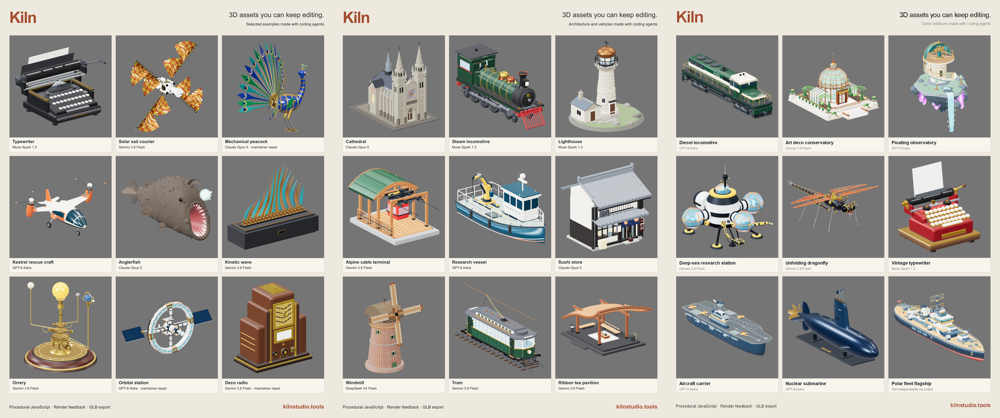
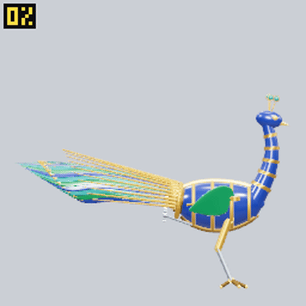
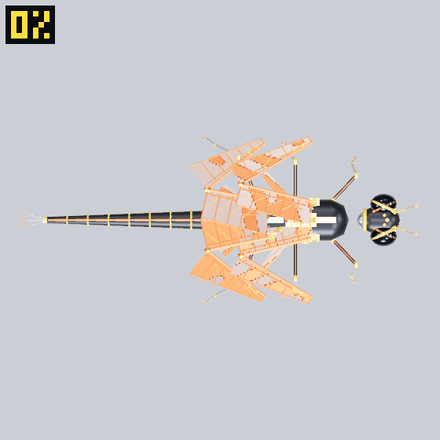
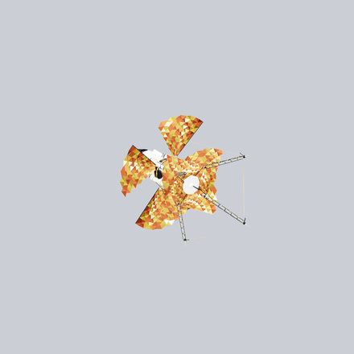

# Kiln

[](https://github.com/matthew-kissinger/kiln/actions/workflows/ci.yml)
[](LICENSE)

**Build and revise 3D assets with your coding agent.**

The agent writes JavaScript using Kiln's geometry and material helpers. Kiln runs the
program and returns rendered views and structural checks so the agent can review its
work. Export the asset as a GLB and keep the source for later changes.

Kiln runs locally. It includes an MCP server, a CLI, a TypeScript library, and skills
for authoring, editing, animation review, and scene composition. Your agent supplies
the model; Kiln does not require a separate model API key for its tools.

https://github.com/user-attachments/assets/375327bc-58bc-4344-bbb4-985d92c6f63a

[](https://kilnstudio.tools/#/gallery)

<sub>Click the gallery banner above or select an asset below to explore in interactive 3D:</sub><br>
<sub>
<a href="https://kilnstudio.tools/#/typewriter">Typewriter</a> &middot;
<a href="https://kilnstudio.tools/#/solar-sail-courier">Solar Sail Courier</a> &middot;
<a href="https://kilnstudio.tools/#/mechanical-peacock">Mechanical Peacock</a> &middot;
<a href="https://kilnstudio.tools/#/kestrel-rescue-craft">Kestrel Rescue</a> &middot;
<a href="https://kilnstudio.tools/#/anglerfish">Anglerfish</a> &middot;
<a href="https://kilnstudio.tools/#/kinetic-wave">Kinetic Wave</a> &middot;
<a href="https://kilnstudio.tools/#/orrery">Orrery</a> &middot;
<a href="https://kilnstudio.tools/#/orbital-station">Orbital Station</a> &middot;
<a href="https://kilnstudio.tools/#/deco-radio">Deco Radio</a> &middot;
<a href="https://kilnstudio.tools/#/cathedral">Cathedral</a> &middot;
<a href="https://kilnstudio.tools/#/steam-locomotive">Steam Locomotive</a> &middot;
<a href="https://kilnstudio.tools/#/lighthouse">Lighthouse</a> &middot;
<a href="https://kilnstudio.tools/#/alpine-cable-terminal">Alpine Cable Terminal</a> &middot;
<a href="https://kilnstudio.tools/#/research-vessel">Research Vessel</a> &middot;
<a href="https://kilnstudio.tools/#/sushi-store">Sushi Store</a> &middot;
<a href="https://kilnstudio.tools/#/windmill">Windmill</a> &middot;
<a href="https://kilnstudio.tools/#/tram">Tram</a> &middot;
<a href="https://kilnstudio.tools/#/ribbon-tea-pavilion">Ribbon Tea Pavilion</a> &middot;
<a href="https://kilnstudio.tools/#/demo-diesel-locomotive">Diesel Locomotive</a> &middot;
<a href="https://kilnstudio.tools/#/demo-art-deco-conservatory">Art Deco Conservatory</a> &middot;
<a href="https://kilnstudio.tools/#/demo-floating-observatory">Floating Observatory</a> &middot;
<a href="https://kilnstudio.tools/#/demo-deep-sea-station">Deep Sea Station</a> &middot;
<a href="https://kilnstudio.tools/#/demo-unfolding-dragonfly">Unfolding Dragonfly</a> &middot;
<a href="https://kilnstudio.tools/#/demo-vintage-typewriter">Vintage Typewriter</a> &middot;
<a href="https://kilnstudio.tools/#/demo-argent-aircraft-carrier">Argent Carrier</a> &middot;
<a href="https://kilnstudio.tools/#/demo-noctilus-nuclear-submarine">Noctilus Submarine</a> &middot;
<a href="https://kilnstudio.tools/#/demo-resolute-polar-fleet-flagship">Resolute Flagship</a>
</sub>

| Mechanical peacock · Claude Opus 5 | Unfolding dragonfly · GPT-6 Astra | Solar sail courier · Gemini 3.8 Flash |
| --- | --- | --- |
| [](https://kilnstudio.tools/#/mechanical-peacock) | [](https://kilnstudio.tools/#/demo-unfolding-dragonfly) | [](https://kilnstudio.tools/#/solar-sail-courier) |

[Browse the interactive gallery](https://kilnstudio.tools/#/gallery)
· [All examples and model credits](docs/examples.md)

These are saved examples from different authoring runs, not a model ranking.
They are historical showcases from earlier Kiln versions, with unvetted modeling
issues; they are not golden outputs or reference solutions.
[Credits, review conditions and build records](docs/example-provenance.md).

Version **0.8.0** unifies authoring around Discovery and optional requirements,
with updated geometry helpers, edit evidence and separate native-agent context.
It is a source update; an official 0.8.0 package has not been published. Use the
[versioned source installation](docs/install.md#use-the-08-source-release) for the
new tools. The [qualification report](docs/reviews/2026-09-23-v08-candidate.md)
records checks and support limits; the [progress checkpoint](docs/plans/2026-09-22-progress-checkpoint.md)
retains the detailed work history.


Start with the [installation guide](docs/install.md) for a built package on macOS,
Windows, or Linux. It uses Node.js and creates a project-local agent setup.
Prior releases have package receipts on Windows, Linux, and hosted macOS runners
for Apple Silicon and Intel. Those [platform receipts](docs/evaluation/platform-matrix.md)
do not qualify the current candidate;
real-world setup reports and GPU checks remain welcome from contributors.

## Run from a checkout

Install [Bun](https://bun.sh), then:

```sh
git clone --filter=blob:none https://github.com/matthew-kissinger/kiln
cd kiln
bun install --frozen-lockfile
bun run kiln render examples/crate.kiln.js --out crate.glb --views sheet.png
```

`--filter=blob:none` checks out the current tree in full and leaves historical
file contents on the server, fetching them only if you ask for an old revision.
A plain `git clone` also works and gives you the whole history up front.

This writes a GLB and a six-view image of an existing program. It makes no model call.
Rendering uses the CPU unless a compatible local GPU service is available.
Use `--render cpu` to select the CPU explicitly. Sheets sit on a neutral grey; add
`--backdrop dark` or `--backdrop light` when an asset's silhouette merges with it; `kiln save`
takes the same flag for the preview it stores.

For anchored CLI edits, import source with `kiln source asset.kiln.js`, then run
`kiln edit RETURNED_REF --edits edits.json`. The file contains an array of
`{ "oldString": "exact existing text", "newString": "replacement text" }` objects.
The command returns a new immutable reference and diff without executing source;
render that new reference to inspect the result. `kiln edit --help` describes
batch limits and `replaceAll`.

**Using assets in Blender or Unity?** Read the [handoff guide](docs/engine-handoff.md) for direct GLB import,
materials, backfaces, named pivots and animation checks. The established exporter remains
the default. An **experimental community exporter** is available for explicit comparison
when you need its additional feature preservation; the guide includes activation, rollback
and known limitations. No separate repository is required once this integration is on main.

History was rewritten on 2026-09-10 to drop 288 MB of gallery renders and launch
video that no tool reads, taking a clone from 440 MB to 60 MB, or 49 MB with
`--filter=blob:none`; measured 2026-09-12. Every commit survived and the tree is
unchanged apart from those files, but every commit hash changed, so a clone made
before that date cannot fast-forward.

Re-cloning is simplest. To convert a clone you already have, move the **tag** as
well as the branch:

```sh
git fetch --tags --force origin
git reset --hard origin/main
git reflog expire --expire=now --all
git gc --prune=now
```

`--force` is the load-bearing flag. `oss-2026-09-05` was rewritten too, and git
will not move a tag that already exists without it: plain `git fetch --tags`, and
even `--prune-tags`, both report `would clobber existing tag` and leave the old
one in place, holding every removed file reachable. Omit it and `.git` stays at
228 MB where a fresh clone is 26 MB; run it and the same clone packs to 23 MB.

The gallery images are served from `assets.kilnstudio.tools`; the 83 poster
receipts that attest their bytes stayed in `examples/renders/`.

## Connect your agent

The [agent reading guide](site/public/llms.txt) links to setup, tool schemas and the
source revision workflow in plain text.

Create a separate directory for your assets. The setup command writes project-local
configuration and copies the Kiln skills; it does not change your global settings.

```sh
bun run build:runtime
node scripts/create-workspace.mjs ../my-assets --harness opencode
cd ../my-assets
# Follow START.md for your harness
```

Choose `claude`, `codex`, `opencode`, `hermes`, `agy`, `copilot`, or `cursor-agent` for `--harness`, then open that harness in the
new directory using its generated START.md instructions and accept its project and MCP trust prompts. Sign in to your harness
first. The compiled MCP server and CLI accept Node.js 20.15.0+ on the 20.x line,
or 22.2.0 and later. Bun is for building and testing the engine; installed commands
do not require it. The optional native Strands agent requires Node 22.2.0+.
See the [runtime requirements and qualification limits](docs/install.md).

If the brief depends on textures, roughness, metalness, glass, or other material evidence,
check the optional [GPU renderer setup](docs/rendering.md#running-the-gpu-renderer) before
the first authoring session. Auto mode starts a compatible local service lazily when its
dependencies are available. CPU views are useful for shape and contact, but not for judging
materials. After dependency repair or a failed startup, call
`kiln_renderer({action:"reprobe"})` inside the MCP session to refresh its connection.
Restart after changing Kiln, environment variables or credentials. A compatible
renderer can also run on another device: configure the MCP server's
`KILN_RENDER_PORT_URL` and `KILN_RENDER_TOKEN`, or use CLI `--render-port URL` with
the token in its environment. The [rendering guide](docs/rendering.md#running-the-gpu-renderer)
covers remote service authentication and lifecycle.

**Follow START.md rather than launching the harness directly.** Some harnesses keep all
configuration in a user-level home and read nothing from a project directory, so the workspace
reaches them through a small generated launcher -- `node codex.mjs`, `node agy.mjs`,
`node hermes.mjs` -- which passes the server, the program store and the directory per
invocation. Nothing is written outside the workspace and your existing configuration and
sign-in are left alone. Starting those harnesses with their bare command in the workspace finds
no Kiln tools. START.md names the right command for the harness you chose, and hermes needs one
extra user-level registration that it prints for you.

Try: “Read AGENTS.md, then make a wooden workbench with a lower shelf. Render it,
review the result, and save the source and GLB.”

Setup installs the core authoring, refinement and QA skills. Composition and batch workflows are opt-in.
These skills work with your chosen harness through CLI/MCP. The optional built-in
Strands agent adds its own workflow internally; do not copy that context into your
harness. See [the workflow boundary](docs/runtime.md#optional-native-strands-workflow).

The workspace contains your brief, assets, and skills. The engine source and example
collection stay in the installation directory. See [clean-room setup](docs/clean-room.md)
for the exact boundaries and headless use, or [installation](docs/install.md) for other
harnesses and the plugin path.

For Google models, see [Antigravity and Gemini setup](docs/google.md). Local coding
agents use stdio directly; browser chat connections have different setup requirements.

## Revise an asset

Save finished work into this workspace with
`node kiln.mjs save workbench.kiln.js --name "Workbench"`, or add
`--collection library` when you explicitly want it in your cross-workspace user library.
Run `node kiln.mjs view` to browse **This project** and **Your library**, inspect revisions,
and download GLBs or editable ZIP bundles. Both use the same portable collection format and
the same viewer. See [saved assets and the viewer](docs/collections.md).

For application delivery, export with `--profile runtime --out asset.glb` to move
Kiln's animation review metadata into a hash-linked JSON sidecar. Native glTF animation
still plays without that sidecar. The default `editable` profile preserves saved files
exactly; keep its ZIP for source and build records. The delivery profile is independent
of the established/experimental converter selected during generation.
[Which options to use, why they exist, and examples](docs/export-profiles.md#which-option-should-i-use)
are also included in the authoring and QA skills installed into new asset workspaces.

## Use Kiln in a chat client

Create and refine assets in ChatGPT through a private MCP connection, then ask to
see a saved revision. `kiln_present` opens that exact revision in an interactive 3D card in
supporting MCP App clients. Every coding harness receives exact artifact descriptors and readable
resource URIs in the JSON result; a verified host can opt into core MCP `resource_link` blocks.
An agent can also launch the local viewer on the saved revision and provide its loopback URL.
Orbit the model and inspect its animation without leaving chat.
ChatGPT viewing was verified with real saved assets.

1. Build the runtime and connect its stdio MCP server through an OpenAI Secure
   MCP Tunnel scoped to your workspace.
2. Install the authoring and refinement skills with their reference files using
   ChatGPT's native skill uploader.
3. Ask: “Make a field recorder, review the renders, save it to my project
   collection, and show it with `kiln_present`.”

The [ChatGPT setup guide](docs/chatgpt.md) covers connection, skill packaging, and
host requirements. This currently needs developer setup; it is not a public
one-click ChatGPT app. Local GLB and editable ZIP downloads work through
`kiln view`. ChatGPT-native GLB/ZIP attachments remain unverified; download support
depends on the client or a host-provided delivery link.

## Restore source for another edit

Import an existing program from your asset workspace:

```sh
node kiln.mjs source workbench.kiln.js
```

The command prints a short `programRef`, such as `p_7c94a132b8e0`, identifying that
exact source. Copy it exactly for later calls:

```js
// programRef is the value returned by Kiln.
kiln_source({ programRef, query: "shelfHeight" })
kiln_edit({
  programRef,
  edits: [{ oldString: "shelfHeight = 0.2", newString: "shelfHeight = 0.35" }]
})
```

`kiln_source` reads a bounded portion of the source. `kiln_edit` applies the changes
and renders the result, returning a new reference and a diff. The original revision
remains available. Text outside the replacements stays unchanged, and a failed edit
does not modify the base.

Save the new revision and export it without copying its source through the model:

```sh
node kiln.mjs source RETURNED_REF --out workbench-v2.kiln.js
node kiln.mjs render RETURNED_REF --out workbench-v2.glb --views workbench-v2.png
```

Replace `RETURNED_REF` with the new reference from the edit. Short references survive
local server restarts while you keep the workspace's store. Full SHA-256 references
are still accepted. Inline `code` still works for new drafts and
existing integrations. [Program storage and API details](docs/programs.md).

## Shape geometry and choose views

Keep equations and custom modeling functions in the program. For example, this
samples a curved sheet; the [complete canopy example](site/examples/equation-canopy.kiln.js)
adds its material, posts and sockets.

```js
const surface = parametricSurface(
  (u, v) => [u, 1.35 + 0.22 * Math.sin(u * 2) + 0.12 * v * v, v],
  { u: [-1.6, 1.6], v: [-0.8, 0.8],
    uSegments: 48, vSegments: 24, orientation: 'vu' }
);
```

Use `meshGeo` for explicit topology, or shape existing geometry with bends, twists,
lofts and sweeps. [Geometry contracts and limits](docs/geometry.md).

To check an attachment, request a close-up beside a whole-asset view. Reuse the
`programRef` and exact `partPath` from the render result:

```js
kiln_render({ programRef, capture: {
  version: 'kiln.capture.v1', cols: 2,
  shots: [
    { name: 'Whole asset' },
    { name: 'Attachment', subject: { path: partPath },
      visibility: 'context', camera: { type: 'orbit', relativeTo: 'part',
        azimuthDeg: 65, elevationDeg: -18, padding: 3 } }
  ]
}});
```

The close-up follows the part's local axes while retaining surrounding geometry.
You can also set explicit camera positions, return separate images, or sample
animation frames. Either capture shape also takes `backdrop: 'neutral' | 'dark' |
'light'`, and every result echoes the one used as `capture.backdrop`. `kiln_save` takes the
same field for the preview it stores, and the manifest records it as `preview.backdrop`.
[Camera controls](docs/cameras.md).

## Tool reference

Use `kiln_discover` to find operations, assemblies and optional recipes in ordinary
modeling language. An empty request returns a compact overview with starting
signatures and six summaries. For example, search with `{ query: "curved hollow tube" }`,
then request `{ ids: ["sweepProfile"] }` for a complete contract and example. Exact
batches accept up to six distinct IDs or executable names. Search is local and needs
no separate model, network call, or asset-category selection.

The same workflow is available in the CLI:

```sh
bun run kiln discover --query "curved hollow tube"
bun run kiln discover --id sweepProfile --id createPart --json
bun run kiln discover --kind recipe
bun run kiln discover --capabilities
```

Search and overview accept `family`, `kind`, `tags`, `offset` and `limit` (default six,
maximum twelve). CLI uses `--family`, `--kind`, repeated `--tag`, `--offset` and `--limit`.
Browse current filter labels in the overview. Search relevance does not certify that
a helper supports the entire requested asset; read its limitations and exact contract.

`kiln_list_primitives` and its `name`, `names`, and `category` selectors are removed,
with no callable alias. Stop the harness/MCP session, then run `kiln-init WORKSPACE
--check` and `kiln-init WORKSPACE --upgrade` from the updated installation. Upgrade
preserves assets and refuses conflicting local changes; resolve those explicitly
before retrying. Restart the session to load current schemas. A fresh workspace is
also supported. `--repair` repairs paths without upgrading copied skills. Use
`kiln migrate intent|manifest OLD.json --out REVIEW.json` for an explicit legacy-data
review; unresolved obligations prevent activation. See [migration](docs/migration.md).
The
[generated tool reference](docs/tools.md) covers source editing, validation,
rendering, part inspection, animation and interior views. The shared factory is
`createKilnProgramToolRegistry` in `@kiln/engine/tools`.

## Uses and limitations

The examples cover props, machinery, vehicles, buildings and rigid-part animation.
Programs are useful when you want named parts, adjustable dimensions and repeatable
variants. Organic shapes and detailed character work are less well demonstrated.
Kiln is not a reconstruction tool: a reference image does not establish unseen geometry.

Structural checks help find problems, but do not establish visual quality or suitability
for a particular game. Review scale, performance, collision and appearance in your target
scene. The CPU renderer shows geometry and base colours; inspect `viewFidelity` before
judging textures or PBR materials. [GPU setup and materials](docs/rendering.md).

## Development

```sh
bun run typecheck
bun run lint
bun run test
bun run test:coverage
```

Tests run without model calls and use CPU rendering. Coverage thresholds are checked
in CI. Runtime changes to the MCP server or CLI must also rebuild their committed bundles:

```sh
bun run build:runtime
```

For bug reports, include the smallest program that reproduces the problem and the
render or error you saw. [CONTRIBUTING.md](CONTRIBUTING.md) covers setup, checks and
pull requests; [AGENTS.md](AGENTS.md) covers repository conventions.

- [Library and architecture](docs/architecture.md)
- [Headless generation](docs/dispatch.md)
- [Headless harnesses](docs/harnesses.md)
- [Program-reference design](docs/programs.md)
- [Example collection](docs/examples.md)
- [Production history](docs/history/production-architecture.md)

Kiln began as the engine behind Kiln Studio. The hosted product has retired; this
repository contains the open-source engine and local tools.

MIT licensed. Built by Matthew Kissinger.
