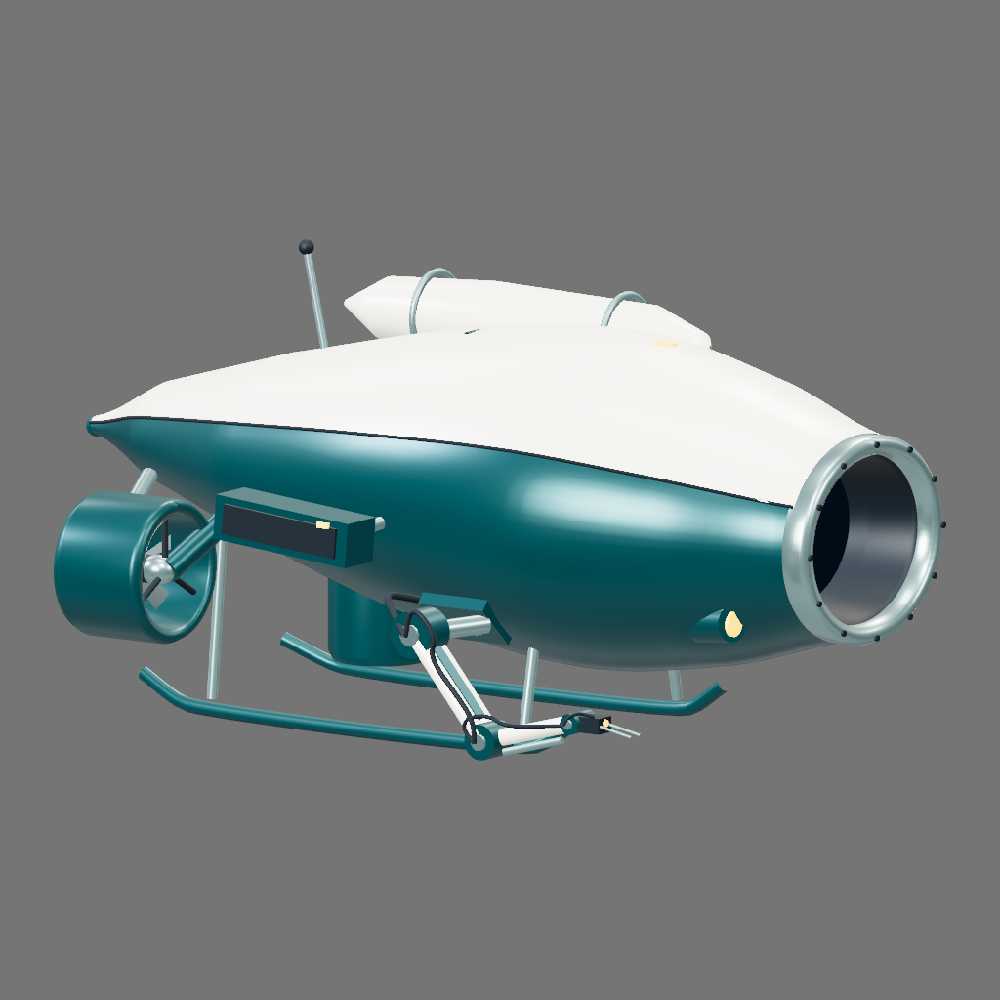
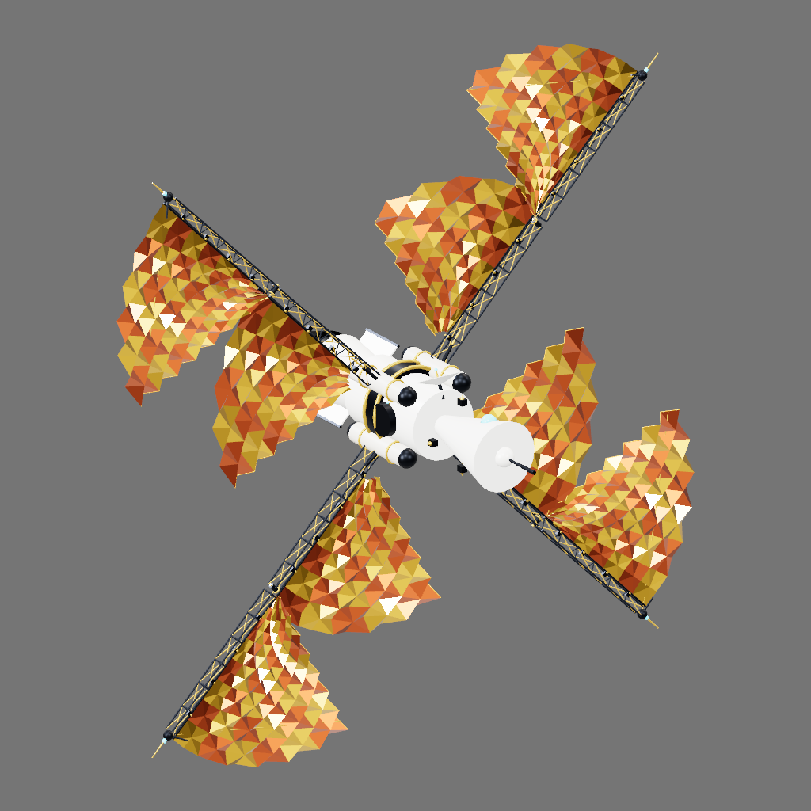

# Kiln

[](https://github.com/matthew-kissinger/kiln/actions/workflows/ci.yml)
[](LICENSE)

**Build and revise 3D assets with your coding agent.**

The agent writes JavaScript using Kiln's geometry and material helpers. Kiln runs the
program and returns rendered views and structural checks so the agent can review its
work. Export the asset as a GLB and keep the source for later changes.

Kiln runs locally. It includes an MCP server, a CLI, a TypeScript library, and skills
for authoring, editing, animation review, and scene composition. Your agent supplies
the model; Kiln does not require a separate model API key for its tools.

| Abyssal surveyor · GPT-6 Astra | Typewriter · Muse Spark 1.3 | Solar sail courier · Gemini 3.8 Flash |
| --- | --- | --- |
| [](examples/abyssal-surveyor.kiln.js) | [](examples/typewriter.kiln.js) | [](examples/solar-sail-courier.kiln.js) |

[Browse the interactive gallery](https://kilnstudio.tools/#/gallery)
· [All examples and model credits](docs/examples.md)

These are saved examples from different authoring runs, not a model ranking.
[Credits, review conditions and build records](docs/example-provenance.md).

Start with the [installation guide](docs/install.md) for a built package on macOS,
Windows, or Linux. It uses Node.js and creates a project-local agent setup.
Windows and Linux package checks pass. macOS setup is documented; native testing
and fixes are welcome through [community contributions](CONTRIBUTING.md#help-verify-macos).

## Run from a checkout

Install [Bun](https://bun.sh), then:

```sh
git clone https://github.com/matthew-kissinger/kiln
cd kiln
bun install --frozen-lockfile
bun run kiln render examples/crate.kiln.js --out crate.glb --views sheet.png
```

This writes a GLB and a six-view image of an existing program. It makes no model call.
Rendering uses the CPU unless a compatible local GPU service is available.
Use `--render cpu` to select the CPU explicitly.

## Connect your agent

The [agent reading guide](site/public/llms.txt) links to setup, tool schemas and the
source revision workflow in plain text.

Create a separate directory for your assets. The setup command writes project-local
configuration and copies the Kiln skills; it does not change your global settings.

```sh
bun run build:runtime
node scripts/create-workspace.mjs ../my-assets --harness opencode
cd ../my-assets
# Follow START.md for your harness
```

Choose `claude`, `codex`, `opencode`, `hermes`, or `agy` for `--harness`, then open that harness in the
new directory using its generated START.md instructions and accept its project and MCP trust prompts. Sign in to your harness
first. The MCP server and local CLI are tested on Node.js 22.23.1.

Try: “Read AGENTS.md, then make a wooden workbench with a lower shelf. Render it,
review the result, and save the source and GLB.”

Setup installs the core authoring, refinement and QA skills. Composition and batch workflows are opt-in.

The workspace contains your brief, assets, and skills. The engine source and example
collection stay in the installation directory. See [clean-room setup](docs/clean-room.md)
for the exact boundaries and headless use, or [installation](docs/install.md) for other
harnesses and the plugin path.

## Revise an asset

Import an existing program from your asset workspace:

```sh
node kiln.mjs source workbench.kiln.js
```

The command prints a `programRef` identifying that exact source. The agent can use it
for every later call:

```js
// Use the full reference returned by Kiln in place of the placeholders.
kiln_source({ programRef: "sha256:...", query: "shelfHeight" })
kiln_edit({
  programRef: "sha256:...",
  edits: [{ oldString: "shelfHeight = 0.2", newString: "shelfHeight = 0.35" }]
})
```

`kiln_source` reads a bounded portion of the source. `kiln_edit` applies the changes
and renders the result, returning a new reference and a diff. The original revision
remains available. Text outside the replacements stays unchanged, and a failed edit
does not modify the base.

Save the new revision and export it without copying its source through the model:

```sh
node kiln.mjs source sha256:FULL_REFERENCE --out workbench-v2.kiln.js
node kiln.mjs render sha256:FULL_REFERENCE --out workbench-v2.glb --views workbench-v2.png
```

References survive local server restarts. Inline `code` still works for new drafts and
existing integrations. [Program storage and API details](docs/programs.md).

## Shape geometry and choose views

Keep equations and custom modeling functions in the program. For example, this
samples a curved sheet; the [complete canopy example](site/examples/equation-canopy.kiln.js)
adds its material, posts and sockets.

```js
const surface = parametricSurface(
  (u, v) => [u, 1.35 + 0.22 * Math.sin(u * 2) + 0.12 * v * v, v],
  { u: [-1.6, 1.6], v: [-0.8, 0.8],
    uSegments: 48, vSegments: 24, orientation: 'vu' }
);
```

Use `meshGeo` for explicit topology, or shape existing geometry with bends, twists,
lofts and sweeps. [Geometry contracts and limits](docs/geometry.md).

To check an attachment, request a close-up beside a whole-asset view. Reuse the
`programRef` and exact `partPath` from the render result:

```js
kiln_render({ programRef, capture: {
  version: 'kiln.capture.v1', cols: 2,
  shots: [
    { name: 'Whole asset' },
    { name: 'Attachment', subject: { path: partPath },
      visibility: 'context', camera: { type: 'orbit', relativeTo: 'part',
        azimuthDeg: 65, elevationDeg: -18, padding: 3 } }
  ]
}});
```

The close-up follows the part's local axes while retaining surrounding geometry.
You can also set explicit camera positions, return separate images, or sample
animation frames. [Camera controls](docs/cameras.md).

## Tool reference

Use `kiln_list_primitives` to discover signatures and examples. The
[generated tool reference](docs/tools.md) covers source editing, validation,
rendering, part inspection, animation and interior views. The shared factory is
`createKilnProgramToolRegistry` in `@kiln/engine/tools`.

## Uses and limitations

The examples cover props, machinery, vehicles, buildings and rigid-part animation.
Programs are useful when you want named parts, adjustable dimensions and repeatable
variants. Organic shapes and detailed character work are less well demonstrated.
Kiln is not a reconstruction tool: a reference image does not establish unseen geometry.

Structural checks help find problems, but do not establish visual quality or suitability
for a particular game. Review scale, performance, collision and appearance in your target
scene. The CPU renderer shows geometry and base colours; inspect `viewFidelity` before
judging textures or PBR materials. [GPU setup and materials](docs/rendering.md).

## Development

```sh
bun run typecheck
bun run lint
bun run test
bun run test:coverage
```

Tests run without model calls and use CPU rendering. Coverage thresholds are checked
in CI. Runtime changes to the MCP server or CLI must also rebuild their committed bundles:

```sh
bun run build:runtime
```

For bug reports, include the smallest program that reproduces the problem and the
render or error you saw. [CONTRIBUTING.md](CONTRIBUTING.md) covers setup, checks and
pull requests; [AGENTS.md](AGENTS.md) covers repository conventions.

- [Library and architecture](docs/architecture.md)
- [Headless generation](docs/dispatch.md)
- [Program-reference design](docs/programs.md)
- [Example collection](docs/examples.md)
- [Production history](docs/history/production-architecture.md)

Kiln began as the engine behind Kiln Studio. The hosted product has retired; this
repository contains the open-source engine and local tools.

MIT licensed. Built by Matthew Kissinger.
